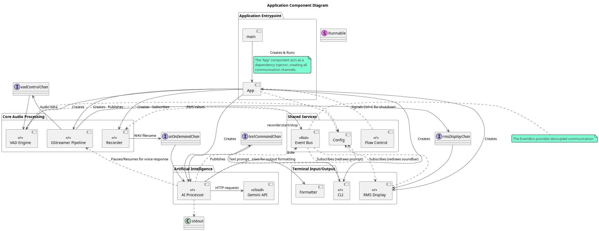
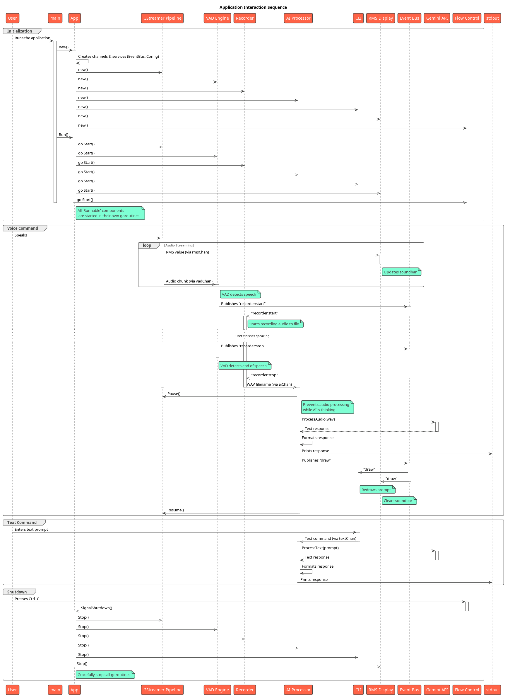

# Go AI Voice/Text Assistant

This project is a command-line AI assistant written in Go. It can accept commands via both voice and text, process them using the Google Gemini API, and display the results in the terminal. It features a decoupled, event-driven architecture designed for clarity and extensibility.

## Features

- **Dual Input Modes**: Accepts commands via both voice and direct text entry.
- **Voice Activity Detection (VAD)**: Listens for audio and only records when speech is detected, saving resources and improving accuracy.
- **Real-time Audio Visualization**: Displays a live RMS soundbar in the terminal so the user knows when the microphone is active.
- **Flexible Audio Source**: Record from a standard microphone or capture desktop/system audio by specifying a PulseAudio source device in the configuration.
- **Advanced AI Integration**: Leverages the Gemini API for powerful natural language processing, tool use (Google Search), and response generation.
- **Multimedia Prompts**: Process text prompts containing URLs for YouTube videos, images, PDFs, or local file paths.
- **Context Caching**: Caches context files with the Gemini API to reduce token usage and speed up conversations.
- **Conversation History**: Save the current conversation to a text file.
- **Decoupled Architecture**: Components communicate via Go channels and a central Event Bus, minimizing direct dependencies and making the system easier to maintain and test.
- **Graceful Shutdown**: Handles `Ctrl+C` to ensure all components shut down cleanly.

---

## Use Cases & Examples

This assistant is a versatile tool for developers, researchers, and anyone who wants to interact with a powerful AI using voice, text, and various media formats.

### 1. General Q&A and Brainstorming
Use the assistant as a quick knowledge base or a creative partner.

-   **Voice Command**: _"Explain the difference between concurrency and parallelism."_
-   **Text Command**: `> Brainstorm some project names for a Go-based AI assistant.`

### 2. Content Analysis and Summarization
Provide URLs or local files in your text prompts to have the AI analyze them.

-   **YouTube Video Summary**: `> Give me a 5-point summary of this video: https://www.youtube.com/watch?v=...`
-   **Image Description**: `> What is the main subject of this image? https://.../photo.jpg`
-   **PDF Document Analysis**: `> Analyze the key arguments in this paper: file:///path/to/research.pdf`

### 3. Code and Project Assistance
Leverage the context file feature for in-depth analysis of your projects.

1.  Place your source code, documentation, or other text-based files into the `cache` directory (as configured in `config.toml`).
2.  Start the application. It will automatically process these files as context.
3.  Ask questions related to the files.

-   **Code Review**: `> In the provided Go files, are there any obvious race conditions?`
-   **Documentation Query**: `> Based on the README.md, what are the main installation steps?`
-   **Project Onboarding**: `> Give me a high-level overview of the project structure based on the files.`

### 4. Hands-Free Voice Operation
Enable voice responses for a fully conversational experience, perfect for when you're multitasking.

-   Run with the voice flag: `./gemini --voice`

### 5. Audio Recording with VAD
The application can be used as a standalone voice-activated recorder, without interacting with the AI. This is useful for capturing audio from a microphone or recording system audio (e.g., from a video call or presentation) only when there is sound.

1.  **Find your Audio Source:**
    First, you need to identify the name of the PulseAudio source you want to record from. To list available sources, run:
    ```sh
    pactl list short sources
    ```
    Look for your microphone or a "monitor" source (e.g., `alsa_output.pci-0000_00_1f.3.analog-stereo.monitor`).

2.  **Configure the Device:**
    Open your `config.toml` file and set the `device` property in the `[pipeline]` section to the name you found.
    ```toml
    [pipeline]
    # Example for a microphone
    # device = "alsa_input.pci-0000_00_1f.3.analog-stereo"
    # Example for system audio
    device = "alsa_output.pci-0000_00_1f.3.analog-stereo.monitor"
    ```

3.  **Run in Recorder Mode:**
    Launch the application with the `--no-ai` flag. This disables all communication with the Gemini API.
    ```sh
    ./gemini --no-ai
    ```

4.  **Recording:**
    The application will now listen to the selected audio source. When the volume exceeds the configured threshold, it will automatically start recording to a `.wav` file in the current directory (e.g., `recording-1.wav`, `recording-2.wav`, etc.). Recording stops after a period of silence.

---

## Architecture

The application is broken down into several distinct components, each with a specific responsibility. The `App` component acts as an orchestrator and dependency injector, initializing all services and communication channels at startup.

Communication is handled in two primary ways:
1.  **Go Channels**: For high-throughput, point-to-point data streams (e.g., audio data from the `Pipeline` to `VAD`).
2.  **Event Bus**: For decoupled, many-to-many notifications (e.g., `VAD` publishing a "start recording" event that the `Recorder` subscribes to).

### Component Diagram

This diagram shows the static components of the system and their relationships.



---

## Interaction Flow

The sequence diagram below illustrates the two primary user interaction flows: a voice command and a text command. It shows how the components collaborate over time to process a user's request.

### Sequence Diagram



---

## Getting Started

### Prerequisites

- **Go**: Version 1.24 or later.
- **GStreamer**: The core audio processing pipeline relies on GStreamer. You must have the GStreamer core library and base plugins installed on your system.
- **Gemini API Key**: You need an API key from [Google AI Studio](https://aistudio.google.com/apikey).

### Installation & Setup

1.  **Clone the repository:**
    ```sh
    git clone https://github.com/awdf/gemini.git
    cd gemini
    ```

2.  **Install GStreamer (Debian/Ubuntu):**
    ```sh
    sudo apt-get update
    sudo apt-get install -y libgstreamer1.0-dev libgstreamer-plugins-base1.0-dev libgstreamer-plugins-good1.0-dev
    ```

3.  **Configure the application:**
    The application is configured via a `config.toml` file. Copy the `config.example.toml` to `config.toml` and edit it. At a minimum, you must add your API key:
    ```toml
    # config.toml

    [ai]
    # Get your API Key from Google AI Studio: https://aistudio.google.com/app/apikey
    api_key = "YOUR_GEMINI_API_KEY"
    ```

4.  **Build the application:**
    ```sh
    go build -v -o gemini .
    ```

### Running the Application

Execute the compiled binary from your terminal. You can also use the `make launch` command.

```sh
./gemini
```

- To issue a **voice command**, simply speak when the application is running. The RMS soundbar will indicate that it is listening.
- To issue a **text command**, type your prompt and press `Enter`.
- To **exit**, press `Ctrl+C`.

---

## Diagrams

The architecture diagrams are located in the `/UML` directory and are written using PlantUML. If you make changes to the `.puml` files, you must regenerate the PNG images to keep this README up-to-date.

The easiest way to do this is by using the provided Makefile target:

```sh
make diagrams
```

This will generate `components.puml.png` and `sequence.puml.png` in the `UML/` directory.